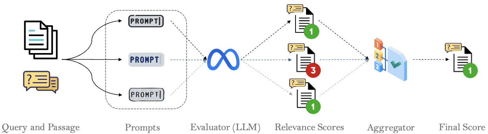
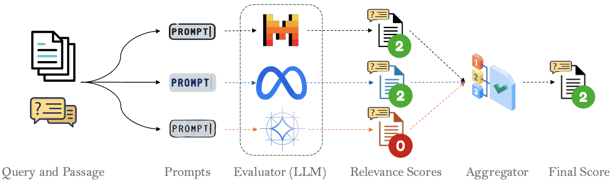
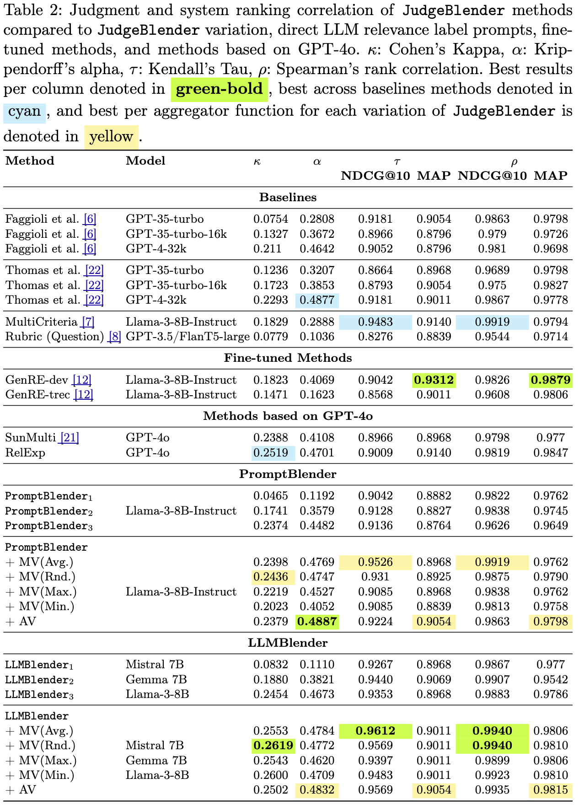

# JudgeBlender
JudgeBlender: Ensembling Judgments for Automatic Relevance Assessment

<div align="center">

  [](https://arxiv.org/abs/2412.13268)
  [](https://pytorch.org/)
  [](https://opensource.org/licenses/MIT)
</div>

## Abstract
The effective training and evaluation of retrieval systems require a substantial amount of relevance judgments, which are traditionally collected from human assessors – a process that is both costly and time-consuming. Large Language Models (LLMs) have shown promise in generating relevance labels for search tasks, offering a potential alternative to manual assessments. Current approaches often rely on a single LLM, such as GPT-4, which, despite being effective, are expensive and prone to intra-model biases that can favour systems leveraging similar models. In this work, we introduce JudgeBlender, a framework that employs smaller, open-source models to provide relevance judgments by combining evaluations across multiple LLMs (LLMBlender) or multiple prompts (PromptBlender). By leveraging the LLMJudge benchmark [18], we compare JudgeBlender with state-of-the-art methods and the top performers in the LLMJudge challenge. Our results show that JudgeBlender achieves competitive performance, demonstrating that very large models are often unnecessary for reliable relevance assessments.

## Methods

### PromptBlender
<p align="center">
  
</p>
<br />

### LLMBlender
<p align="center">
  
</p>
<br />

## Baselines
The baseline models jusgments and prompts are available at [https://llm4eval.github.io/LLM-as-a-rel/](https://llm4eval.github.io/LLM-as-a-rel/)

## Folders and Files

- __TREC-DLs-files__: This folder includes the relevance files for each year of the TREC Deep Learning Track. For each year we have a folder and the folder contains the `run submissions`, the `qrel`, and the `test queries` for that specific year.
- __SynDL-generation__: includes notebooks for creating the depth pools based on the TREC DL past years' submissions and generating the judgment for them. The final created qrel and their judgments are in the `all-queries-processed-errors` folder.
- __SynDL-qrels__: This folder includes the final merged synthetic qrels for all TREC DL years from 2019 to 2023. There are two different qrel files in this folder:
    - __SynDL_qrels_pass.txt__ is the file that only includes the synthetic judgments for the query-document pairs created using a 10-depth pooling approach from each year's submissions.
    - __SynDL_qrels_pass_withNIST.txt__ is the file that not only includes synthetic ones (i.e., _SynDL_qrels_pass.txt_) but also the human judgements for the query-document pairs that are judged by NIST assessors.
- __TREC-DLs-results__: includes the results for each year of the TREC Deep Learning track for `ndcgeval` and `treceval` based on their corresponding `qrel`.
- __SynDL-partial-results__: includes the results for each year of the TREC Deep Learning track for `ndcgeval` and `treceval` based on _SynDL_qrels_pass_withNIST.txt_ qrel.
- __SynDL-full-results__: includes the results for each year of TREC Deep Learning track for `ndcgeval` and `treceval` based on _SynDL_qrels_pass.txt_ qrel.
- __final-results__: includes the merged results files for different years based on different qrels.
 
## Prompt
`prompt.txt` contains the prompt that we used for the relevance judgment generation. This prompt template is inspired by Thomas et al. [2] recent paper on search prefenrce predictions using LLMs.

## Qrels
The qrels files can be found in the `./qrels/` folder. The qrels folder includes two qrel files. The files are with the same format of TREC DL: tab-seprated and similir columns:

> qid 0 docid score

- __SynDL_qrels_pass.txt__: This is the full synthetic qrel file.
- __SynDL_qrels_pass_withHuman.txt__: This qrel includes synthetic qrels based on our depth-10 pooling synthetic qrel construction and human qrels from all 5 years labelled by NIST assessors.

## Systems
Run submissions for each year are included in the `TREC-DLs-files` folder under each year of the TREC DL track folder.

## Results
<p align="center">
  
</a>

## Cite

```
@article{rahmani2024judgeblender,
  title={JudgeBlender: Ensembling Judgments for Automatic Relevance Assessment},
  author={Rahmani, Hossein A and Yilmaz, Emine and Craswell, Nick and Mitra, Bhaskar},
  journal={arXiv preprint arXiv:2412.13268},
  year={2024}
}
```

## Acknowledgments
This research is supported by the Engineering and Physical Sciences Research Council [EP/S021566/1] and the EPSRC Fellowship titled "Task Based Information Retrieval" [EP/P024289/1].
